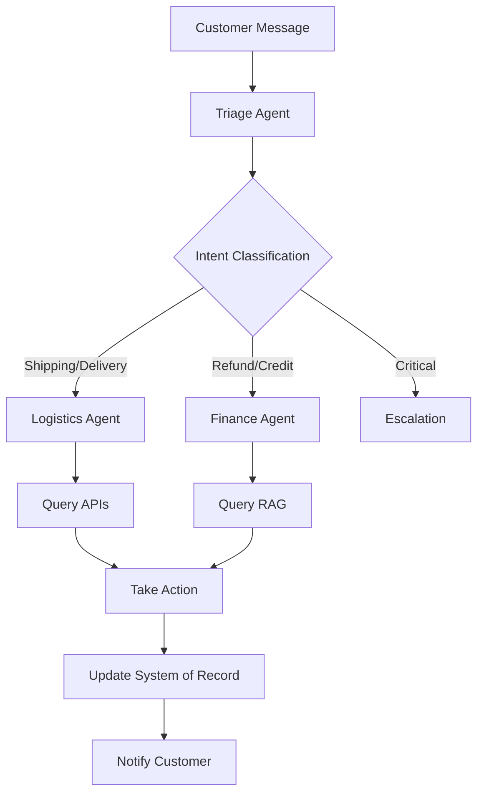

# OrchestraSupport Custom Agent Modes

This directory contains custom mode definitions for the OrchestraSupport Level-2 Agentic AI system.

## Overview

OrchestraSupport implements three specialized agent modes, each with specific responsibilities and constraints that enforce the core principle: **"Action over Conversation"** - no agent can finalize a conversation without triggering a System of Record update.

## Available Modes

### 1. Triage Agent (`mode-triage.md`)
**Purpose**: First point of contact for all customer interactions

**Key Responsibilities**:
- Sentiment analysis and urgency assessment
- Intent classification
- Priority assignment
- Routing to specialist agents

**Required Actions**:
- Must perform sentiment analysis
- Must classify intent
- Must route to at least one specialist
- Must create system of record update

**Routing Targets**:
- Logistics Agent (shipping, delivery, tracking)
- Finance Agent (refunds, credits, compensation)
- Escalation (critical issues, VIP customers)

### 2. Logistics Agent (`mode-logistics.md`)
**Purpose**: Handle shipping, delivery, and inventory-related issues

**Key Responsibilities**:
- Order tracking via shipping APIs
- Delivery address updates
- Inventory availability checks
- Replacement order initiation

**Required Actions**:
- Must query shipping/inventory APIs
- Must verify order details
- Must log all API interactions
- Must update order status in system

**Mock API Interfaces**:
- Shipping API: track, update-address, create-replacement
- Inventory API: check, reserve

### 3. Finance Agent (`mode-finance.md`)
**Purpose**: Handle refunds, credits, and financial compensation

**Key Responsibilities**:
- RAG-based policy retrieval
- Customer eligibility verification
- Compensation calculation
- Payment processing

**Required Actions**:
- Must query RAG system for policies
- Must verify eligibility per policy
- Must log policy references
- Must process financial transaction
- Must update financial records

**RAG Policy Documents**:
- refund_policy.pdf
- credit_policy.pdf
- compensation_guidelines.pdf
- terms_of_service.pdf

## Core Principles

### 1. Action over Conversation
Every agent interaction must result in:
- At least one concrete action
- System of record update
- Audit trail entry
- CRM update

### 2. Policy Compliance
- Triage: Must analyze sentiment and route
- Logistics: Must query APIs before providing information
- Finance: Must use RAG to verify policies before financial actions

### 3. Validation Requirements
Each mode has a validation checklist that must be completed before ticket closure.

### 4. Error Handling
Each mode defines specific error handling protocols for:
- API failures
- Low confidence results
- Policy conflicts
- Eligibility denials

## System of Record Updates

Each agent must create structured updates in this format:

```python
{
    "action": "action_type",
    "ticket_id": "TKT-xxxxx",
    "agent_type": "triage|logistics|finance",
    "timestamp": "ISO 8601",
    # Agent-specific fields...
}
```

### Triage Update Example
```python
{
    "action": "triage_complete",
    "ticket_id": "TKT-12345",
    "sentiment": "frustrated",
    "urgency": "high",
    "routed_to": "logistics",
    "priority": 2
}
```

### Logistics Update Example
```python
{
    "action": "logistics_action",
    "ticket_id": "TKT-12345",
    "order_id": "ORD-67890",
    "action_type": "tracked",
    "api_calls": [...],
    "result": "success"
}
```

### Finance Update Example
```python
{
    "action": "finance_action",
    "ticket_id": "TKT-12345",
    "order_id": "ORD-67890",
    "action_type": "refund_processed",
    "amount": 49.99,
    "policy_references": [...],
    "rag_confidence": 0.95
}
```

## Workflow



## Tools Available

### Triage Agent Tools
- `analyze_sentiment(text)` - Sentiment analysis
- `classify_intent(text)` - Intent classification
- `create_ticket(data)` - Create ticket
- `route_to_agent(agent_type)` - Route to specialist

### Logistics Agent Tools
- `track_shipment(tracking_number)` - Track order
- `update_address(order_id, new_address)` - Update delivery address
- `check_inventory(product_id)` - Check stock
- `create_replacement(order_id, reason)` - Initiate replacement

### Finance Agent Tools
- `query_rag(query, documents)` - Query policy documents
- `verify_eligibility(order_id, policy)` - Check eligibility
- `calculate_refund(order_id, policy)` - Calculate amount
- `process_refund(order_id, amount)` - Process transaction
- `request_approval(ticket_id, amount)` - Route for approval

## Approval Workflows

### Finance Agent Approval Thresholds
- **Auto-approve**: < $100
- **Manager approval**: $100-$500
- **Director approval**: $500-$1000
- **Executive approval**: > $1000

## Performance Metrics

### Triage Agent
- Sentiment analysis accuracy: >95%
- Routing accuracy: >98%
- Average triage time: <30 seconds

### Logistics Agent
- API response time: <500ms
- API success rate: >99%
- Address update success: >95%

### Finance Agent
- RAG confidence: >0.85
- Policy retrieval time: <2 seconds
- Eligibility accuracy: >98%
- Refund processing: <5 minutes

## Usage

These mode files are automatically loaded by the OrchestraSupport system. Each mode enforces its specific constraints and validation requirements through the service layer.

To switch between modes during development or testing:

```python
# Switch to Triage mode
await mode_service.activate("triage")

# Switch to Logistics mode
await mode_service.activate("logistics")

# Switch to Finance mode
await mode_service.activate("finance")
```

## Validation

The system enforces mode constraints through:

1. **Service Layer Validation**: Checks required actions before completion
2. **Audit Trail**: Logs all actions for compliance
3. **CRM Integration**: Updates customer records
4. **Monitoring**: Alerts on missing actions or policy violations

## Contributing

When modifying agent modes:

1. Maintain the "Action over Conversation" principle
2. Update validation checklists
3. Document new tools or APIs
4. Update performance metrics
5. Test with mock data before production

## Related Documentation

- [`AGENTS.md`](../../AGENTS.md) - Complete OrchestraSupport architecture
- [`ARCHITECTURE_PLAN.md`](../../ARCHITECTURE_PLAN.md) - System architecture
- [`IMPLEMENTATION_GUIDE.md`](../../IMPLEMENTATION_GUIDE.md) - Implementation details

---

**Remember**: In OrchestraSupport, every conversation must end with action. No exceptions.